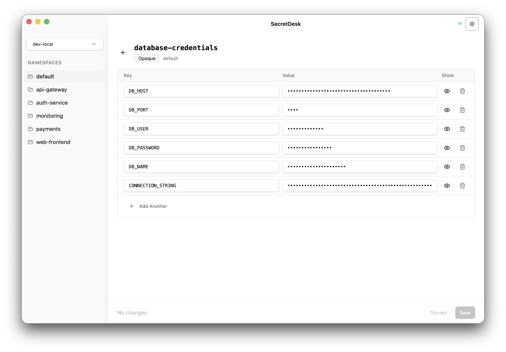

<p align="center">
  
  <h1 align="center">SecretDesk</h1>
</p>

<p align="center">
  <strong>A desktop app for browsing and editing Kubernetes secrets through a clean, intuitive UI</strong>
</p>

<p align="center">
  <a href="#-features">Features</a> •
  <a href="#-installation">Installation</a> •
  <a href="#-usage">Usage</a> •
  <a href="#️-building-from-source">Building from Source</a>
</p>

---

SecretDesk reads your `~/.kube/config`, connects to clusters, and provides a key-value editor with transparent base64 encoding/decoding.

<picture>
  <source media="(prefers-color-scheme: dark)" srcset="images/dark-mode.png">
  <source media="(prefers-color-scheme: light)" srcset="images/light-mode.png">
  
</picture>

## ✨ Features

- 🖥️ **Multi-cluster support** — Switch between kubeconfig contexts
- 📂 **Namespace browser** — Navigate namespaces in the sidebar
- ✏️ **Secret editor** — Vercel-style key-value editor with inline editing
- 👁️ **Show/hide values** — Toggle visibility per row
- 🔧 **Create & delete secrets** — Full CRUD with type selection (Opaque, TLS, Docker, etc.)
- ⚠️ **Conflict detection** — Uses `resourceVersion` for optimistic concurrency (409 handling)
- 🔒 **Binary data detection** — Displays `[Binary data]` for non-UTF-8 values
- 🎨 **Dark/Light/System theme** — Follows system preference or manual override
- ⌨️ **Keyboard shortcuts** — Cmd+S / Ctrl+S to save

## 📦 Installation

Download the latest `.zip` for your Mac from [GitHub Releases](https://github.com/akshitkrnagpal/secret-desk/releases):

- **Apple Silicon** (M1/M2/M3/M4) — `SecretDesk-darwin-arm64-*.zip`
- **Intel** — `SecretDesk-darwin-x64-*.zip`

Unzip and drag **SecretDesk.app** to your Applications folder.

## 📋 Prerequisites

- A valid `~/.kube/config` with at least one cluster configured (i.e. `kubectl` works)

## 🚀 Usage

1. Launch SecretDesk
2. Select a kubeconfig **context** from the sidebar dropdown
3. Pick a **namespace**
4. Browse, create, edit, or delete secrets in the key-value editor
5. Press **Cmd+S** to save changes

## 🛠️ Built With

- **[Electron](https://www.electronjs.org)** — Cross-platform desktop framework
- **[React 19](https://react.dev)** — UI library
- **[TypeScript](https://www.typescriptlang.org)** — Type safety
- **[Vite](https://vite.dev)** — Build tool
- **[Tailwind CSS](https://tailwindcss.com)** — Styling
- **[Radix UI](https://www.radix-ui.com)** — Accessible UI primitives
- **[@kubernetes/client-node](https://github.com/kubernetes-client/javascript)** — Kubernetes API client

## 🏗️ Building from Source

### Prerequisites

- [Node.js](https://nodejs.org/) 22+
- [pnpm](https://pnpm.io/) 10+

### Setup

```bash
# Clone the repo
git clone https://github.com/akshitkrnagpal/secret-desk.git
cd secret-desk

# Install dependencies
pnpm install

# Start development server
pnpm start

# Build distributable
pnpm run make
```

### Project Structure

```
SecretDesk/
├── assets/                # App icons
├── src/
│   ├── main/              # Electron main process
│   │   ├── ipc/           # IPC handlers
│   │   ├── services/      # Kubernetes service layer
│   │   └── main.ts        # Entry point
│   ├── preload/           # Preload scripts
│   ├── renderer/          # React frontend
│   │   ├── components/    # UI components
│   │   ├── context/       # React context providers
│   │   ├── hooks/         # Custom hooks
│   │   ├── lib/           # Utilities
│   │   ├── styles/        # Global styles
│   │   └── App.tsx        # Root component
│   └── shared/            # Shared types
└── package.json
```

## 🤝 Contributing

Contributions are welcome! Please feel free to submit a Pull Request.

1. Fork the repository
2. Create your feature branch (`git checkout -b feature/amazing-feature`)
3. Commit your changes (`git commit -m 'Add some amazing feature'`)
4. Push to the branch (`git push origin feature/amazing-feature`)
5. Open a Pull Request

## 📄 License

This project is open source and available under the [MIT License](LICENSE).

---

<p align="center">
  Made with ❤️ by <a href="https://github.com/akshitkrnagpal">Akshit Kr Nagpal</a>
</p>
